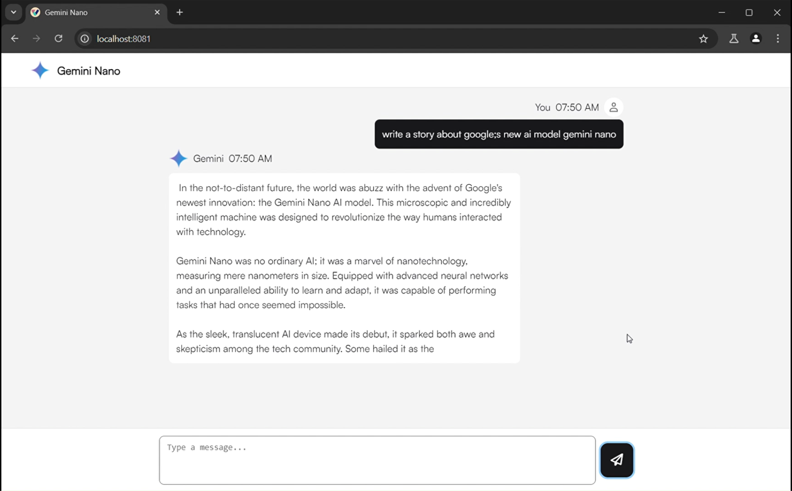

<div align="center">

<h1>chrome-ai-kt</h1>

Using google's new Chrome AI api for a chatbot demo with kotlin/js using [kobweb](https://github.com/varabyte/kobweb)
</div>

## Demo

https://github.com/dead8309/chrome-ai-kt/assets/68665948/ba286c87-b4fd-491e-981c-2be5981c9f08


## Enable AI in Chrome

Chrome built-in AI is a preview feature, you need to use chrome version 127 or greater, now in [dev](https://www.google.com/chrome/dev/?extra=devchannel) or [canary](https://www.google.com/chrome/canary/) channel, [may release on stable chanel at Jul 17, 2024](https://chromestatus.com/roadmap).

After then, you should turn on these flags:
* [chrome://flags/#prompt-api-for-gemini-nano](chrome://flags/#prompt-api-for-gemini-nano): `Enabled`
* [chrome://flags/#optimization-guide-on-device-model](chrome://flags/#optimization-guide-on-device-model): `Enabled BypassPrefRequirement`
* [chrome://components/](chrome://components/): Click `Optimization Guide On Device Model` to download the model.


## Running locally

### Prerequisites

- [Kobweb](https://github.com/varabyte/kobweb?tab=readme-ov-file#install-the-kobweb-binary)
- Kotlin
- Java JDK 11+

Clone the repository:

```bash
git clone https://github.com/dead8309/chrome-ai-kt.git
cd chrome-ai-kt
```

Run the site

```bash
cd site
kobweb run
```